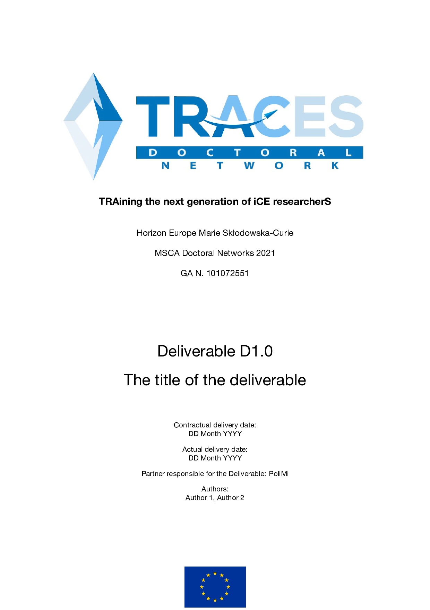

# TRACES Document Template

**Author:** Omar Kahol  
**Email:** omar.kahol@inria.fr

LaTeX document template for TRACES (TRAining the next generation iCE researcherS).

Follows the design guidelines of the consortium with professional formatting for reports, deliverables, and technical documentation.

Requires the packages [fancyhdr](https://www.ctan.org/pkg/fancyhdr), [titlesec](https://www.ctan.org/pkg/titlesec), [TikZ](https://www.ctan.org/pkg/pgf), and [hyperref](https://www.ctan.org/pkg/hyperref) to be installed in your LaTeX distribution.

## Demo



The template includes a comprehensive demonstration file (`main.tex`) illustrating:
- Professional title page with EU and TRACES branding
- Revision table for document version tracking
- Styled sections and subsections
- Mathematical equations
- Tables
- Figures
- Styled lists (itemize and enumerate)
- Bibliography and citation support
- Appendix sections
- Custom footer with EU funding acknowledgment on all pages

## Installation

### Manual Installation

1. Download or clone this repository
2. The template structure includes:
   - `main.tex` - Main document file with user-editable content
  - `tracesdoc.cls` - Styling and title page (LaTeX class)
  - `assets/traces-logo.pdf` - TRACES project logo
  - `assets/eu.png` - EU flag logo
   - `references.bib` - Bibliography database (BibTeX format)
   - `makefile` - Build automation

### Quick Start

Edit the document variables at the top of `main.tex`:

```latex
% --- Document Information (EDIT THESE) ---
\TRACESsetup{
  deliverableNumber={5.1},
  deliverableTitle={Preliminary website with openings},
  disseminationLevel={PU}, % "PU" (Public) or "SEN" (Sensitive)
  workPackageNumber={WP5},
  workPackageLeader={TUBS},
  contractualDeliveryDate={DD Month YYYY},
  actualDeliveryDate={DD Month YYYY},
  partnerResponsible={PoliMi},
  deliverableAuthors={Author 1, Author 2}
}
```

The project information (grant number, acronym, etc.) defaults to standard TRACES values.

### Revision History

The template tracks revisions automatically. Add entries in `main.tex` before `\begin{document}`:

```latex
\addrevision{1.0}{21 Jan 2026}{All}{Author Name}{Initial version}
```

The **Version** of the deliverable is automatically set to the version number of the last added revision entry.

## Customization

### Document Variables

The template provides easy customization through `\TRACESsetup{...}` keys in `main.tex`.

**Key Fields:**
- `deliverableNumber` - E.g. `5.1`
- `deliverableTitle` - The main title of the document
- `disseminationLevel` - Use `PU` for Public or `SEN` for Sensitive
- `workPackageNumber` - E.g. `WP1`, `WP2`, etc. Setting this automatically sets the `workPackageLeader`:
  - WP1: TUDA
  - WP2: ONERA
  - WP3: POLIMI
  - WP4: TUDA
  - WP5: TUBS
- `workPackageLeader` - Optional override (if different from default)
- `contractualDeliveryDate` / `actualDeliveryDate`
- `partnerResponsible`
- `deliverableAuthors`

**Automatic Fields:**
- `deliverableVersion`: Automatically derived from the last `\addrevision` entry.

### Compilation

You can compile the document using the included `makefile`:

```bash
make
```

Or manually using `latexmk`:

```bash
latexmk -pdfxe main.tex
```


### Adding Content

Simply add your content after the revision table in `main.tex`. The template supports:

- **Sections and subsections**: Standard LaTeX `\section{}` and `\subsection{}` commands
- **Equations**: Use `equation` environment for numbered equations
- **Tables**: Use `table` and `tabular` environments (see examples in template)
- **Figures**: Use `figure` environment with `\includegraphics`
- **Lists**: Both `itemize` and `enumerate` environments with TRACES styling
- **Citations**: Use `\cite{}`, `\citet{}`, and `\citep{}` commands (references defined in `references.bib`)

### Bibliography

Add your references to `references.bib` in BibTeX format, then cite them using:

```latex
\cite{reference_key}
```

The bibliography style is set to `plainnat` but can be changed in `main.tex`:

```latex
\bibliographystyle{plainnat}  % natbib-compatible style
```

## Building Your Document

### Using make

If you have `make` installed, simply run:

```bash
make
```

This will:
1. Compile the document with XeLaTeX
2. Process bibliography with BibTeX
3. Generate the final PDF in the root directory

To clean auxiliary files:

```bash
make clean
```

### Manual Compilation

Using XeLaTeX with BibTeX:

```bash
xelatex main.tex
bibtex main
xelatex main.tex
xelatex main.tex  # Run twice more for proper references
```

Using latexmk (recommended):

```bash
latexmk -pdfxe main.tex
```

## Document Structure

```
main.tex                    # Main document with content
tracesdoc.cls                # TRACES LaTeX class (styling + title page)
assets/
  ├── traces-logo.pdf      # TRACES logo
  └── eu.png               # EU flag logo
references.bib             # Bibliography database
makefile                   # Build automation
```

## Requirements

- LaTeX distribution (TeX Live 2020 or later, MiKTeX, etc.)
- XeLaTeX engine (for proper font and Unicode support)
- Required packages:
  - `fancyhdr` - Headers and footers
  - `lastpage` - Page numbering
  - `hyperref` - Hyperlinks and citations
  - `titlesec` - Section formatting
  - `caption` - Caption styling
  - `enumitem` - List customization
  - `amsmath` - Mathematical equations
  - `tikz` - Graphics and decorations
  - `colortbl` - Table row coloring
  - `tabularx` - Flexible tables
  - `geometry` - Page layout
  - `xcolor` - Color definitions

## Features

- **Professional title page** with TRACES and EU branding
- **Revision tracking table** for document version management
- **Consistent styling** across all document elements
- **EU funding footer** automatically included on all pages
- **Bibliography support**
- **Appendix sections** with proper formatting
- **Easy customization** through document variables
- **Automated build system** with makefile

## License

This template is designed for the TRACES consortium and follows their visual identity guidelines.

## Acknowledgments

This project has received funding from the European Union's Horizon Europe research and innovation programme under the Marie Skłodowska-Curie grant agreement No 101072551 (TRACES).
